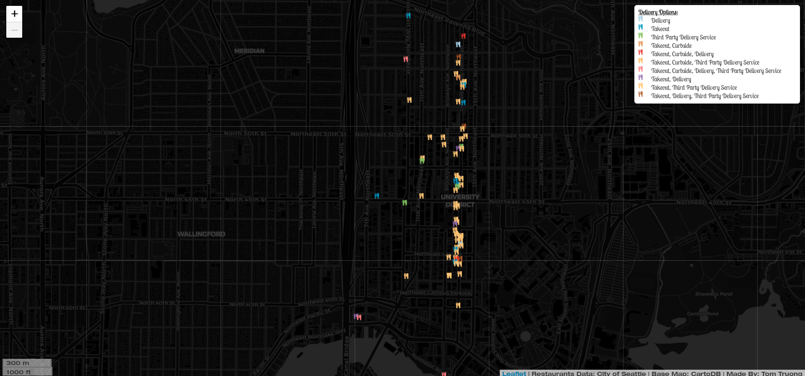
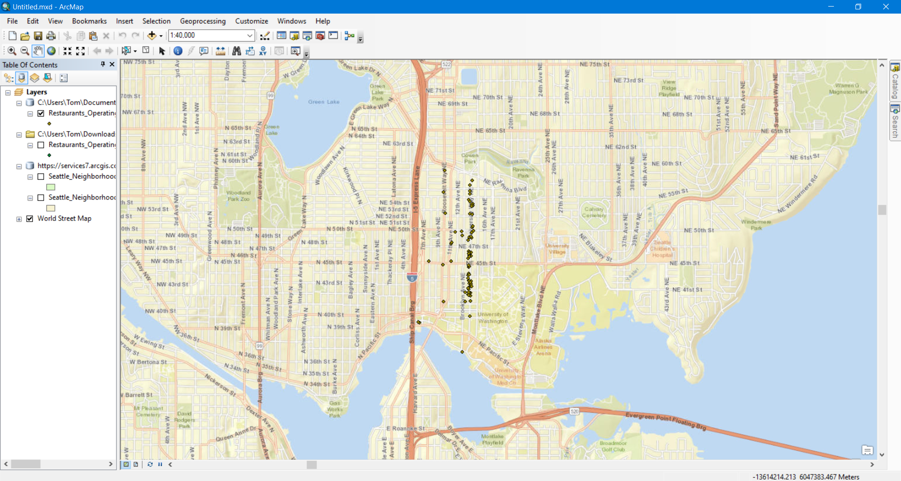
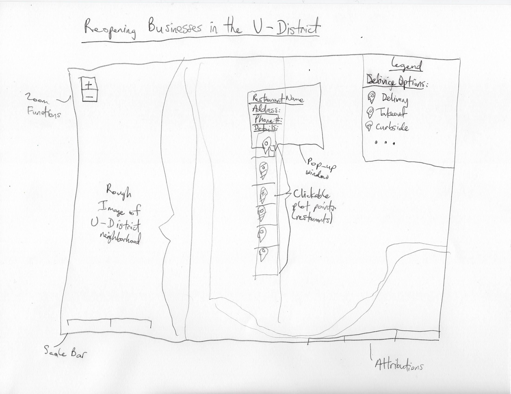

# Reopening Businesses in the U-District

_Screenshot of Web Map showing each restaurant in the U-District_\
[LINK](https://tomtruong062399.github.io/geog458-final-project/)

* * *

## Project Description

This **web map** showcases the businesses, particularly resaurants, in the University District that are currently operating or just opened during the move to a [_"Modified Phase 1 (Phase 1.5)"_](https://kingcounty.gov/depts/health/covid-19/safe-start.aspx) under Governor Inslee's [**Safe Start**](https://www.governor.wa.gov/sites/default/files/SafeStartWA_4May20_1pm.pdf?utm_medium=email&utm_source=govdelivery) initiative to reopening the economy in Washington State. As of _June 10th_, some restaurants has opened for dine-in options for **limited capacity** inside and **distanced outdoor seating.** This is adding onto the safe **takeout**, **third party** and **curbside** delivery services that has been adapted by restaurants since the pandemic outbreak. This webmap will highlight the current **status of services offered** by each restaurant in The U-District neighborhood which is by campus.

## Project Goal

The goal of this project is to deliver _up to date information_ about what is offered for food services for many of the restaurants we students know and love, along [The Ave](https://en.wikipedia.org/wiki/The_Ave) _(University Way NE)_ and beyond the University District boundaries. This is intended towards current students who are **stuck or living on campus or nearby off campus**, that are looking for food options under current safety guidelines. Also, this is to promote **supporting local busineesses** at this time, when same are struggling to maintain their business with the pandemic.

## Data Sources

|                 Name                 |                                                              Description                                                             |                                    URL                                    |                                                    Memo                                                    |     |
| :----------------------------------: | :----------------------------------------------------------------------------------------------------------------------------------: | :-----------------------------------------------------------------------: | :--------------------------------------------------------------------------------------------------------: | --- |
| Restaurants Operating during COVID19 | Data about the operating services offered at restaurants such as bars, cafes, and breweries in King, Pierce, and Snohomish counties. | data.seattle.gov/Land-Base/Restaurants-Operating-during-COVID19/u2jb-5y3s |               Used for the plot markers with clickable overlay of information using the data.              |     |
|         Seattle Neighborhoods        |                                    Shapefile of the neighborhood boundaries of the City of Seattle                                   |   Found inside ArcMap under ArcGIS Online data (Created by MWinslow_IBI)  | Used for spatial analysis of filtering what restaurants fell under the U-District boundary using clipping. |     |
|                                      |                                                                                                                                      |                                                                           |                                                                                                            |     |

_Screenshot of Geospatial Data analyzed from the data from the table above using ArcGIS's ArcMap_

## Interface Sketch

This is a scan of the interface sketch I mocked up to illustrate my plan for the web map application interface. From the sketch it includes **web map components** such as, _zoom functionality_, _scale bar_, _attributions_, and a _legend_. Also it shows the main functionality of **pop-up windows**, highlighting the plot marker's information about its respective restaurant, which is complemented by the legend categorizing the **food service options**.

## Applied Libraries/Web Services

-   **Leaflet** (1.4.0)
-   **Font Awesome** (4.7.0)
-   **Google Fonts** (Lobster Two)
-   **Leaflet Ajax** (2.1.0)
-   **JQuery** (3.1.0)
-   **Chroma-JS** (1.3.4)

## Acknowledgements

I would like to thank the creators of the Data Sources I utilized from [**Claire Palay**](https://www.linkedin.com/in/clairepalay/) from City of Seattle providing the Restaurant Data to user **MWinslow_IBI** for the _Seattle Neighborhoods_ boundaries shapefile for geospatial analysis.

Most importantly I would like to thank [**Professor Bo Zhao**](https://github.com/jakobzhao) for an awesome quarter teaching _GEOG 458 - Digital Geographies_ and his great instructing of how to _design and implement_ digital geography projects!
